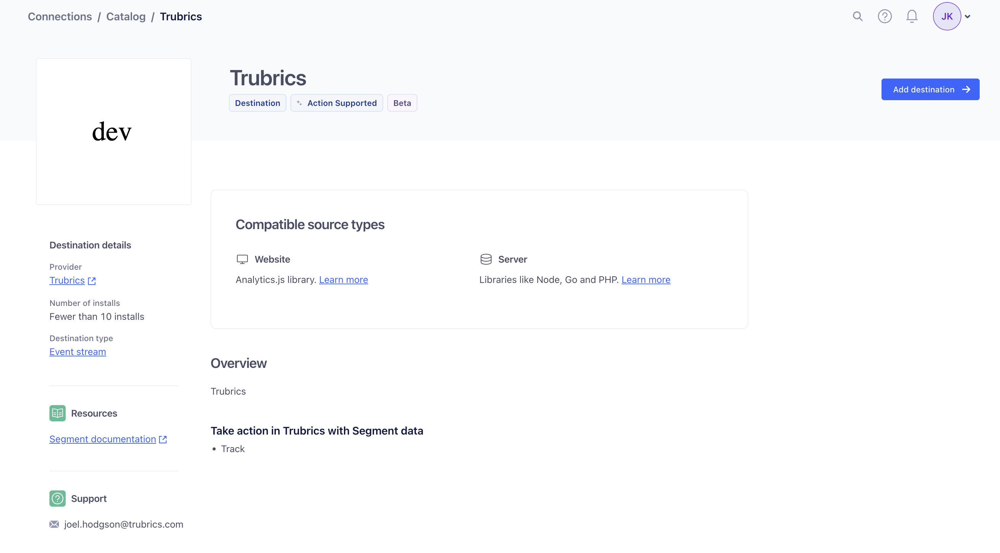

We currently have a Segment integration that allows users to push any events tracked in Segment to Trubrics, without the need to integrate Trubrics in your codebase: 

!!! note
    This integration is in beta, and will soon be available to all users. For now, if you are interested in using this integration, please reach out to us.